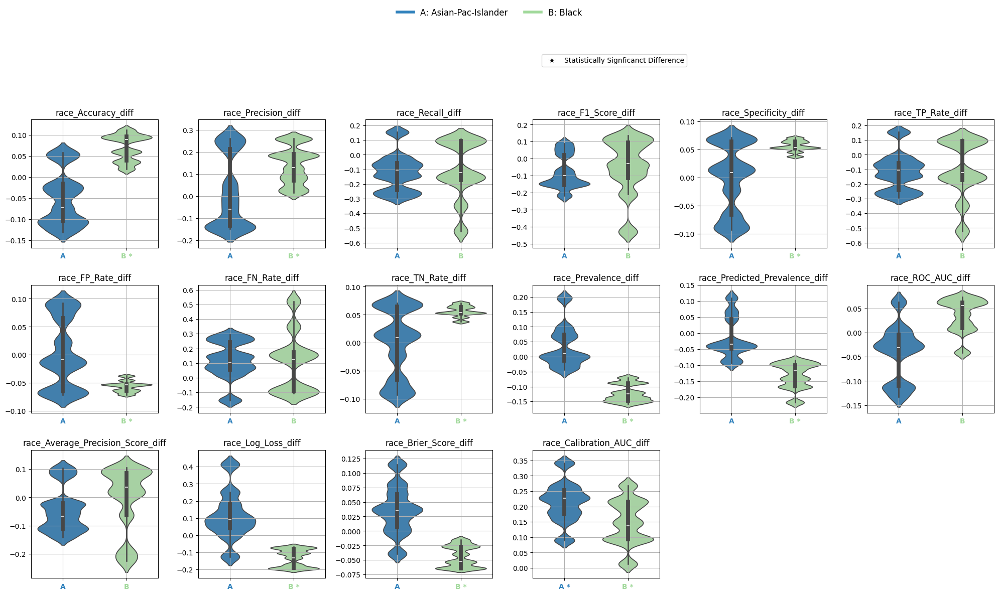

<picture></picture>

[](https://pepy.tech/project/equiboots) [](https://pypi.org/project/equiboots/) [](https://opensource.org/licenses/Apache-2.0) [](https://doi.org/10.5281/zenodo.15086941)

The `equiboots` library is a fairness-aware model evaluation toolkit designed to audit performance disparities across demographic groups. It provides robust, bootstrapped metrics for binary, multi-class, and multi-label classification, as well as regression models. The library supports group-wise performance slicing, fairness diagnostics, and customizable visualizations to support equitable AI/ML development.

`equiboots` is particularly useful in clinical, social, and policy domains where transparency, bias mitigation, and outcome fairness are critical for responsible deployment.

## Prerequisites

Before installing `equiboots`, ensure your system meets the following requirements:

## Python Version

`equiboots` requires **Python 3.7.4 or higher**. Specific dependency versions vary depending on your Python version.

## Dependencies

The following dependencies will be automatically installed with `equiboots`:

- `matplotlib>=3.5.3, <=3.10.1`  
- `numpy>=1.21.6, <=2.2.4`  
- `pandas>=1.3.5, <=2.2.3`  
- `scikit-learn>=1.0.2, <=1.5.2`  
- `scipy>=1.8.0, <=1.15.2`  
- `seaborn>=0.11.2, <=0.13.2`  
- `statsmodels>=0.13, <=0.14.4`
- `tqdm>=4.66.4, <=4.67.1`

## 💾 Installation

You can install `equiboots` directly from PyPI:

```bash
pip install equiboots
```

## 📄 Official Documentation

[Documentation](https://uclamii.github.io/equiboots_docs)

## 🌐 Author Website

https://www.mii.ucla.edu/

## ⚖️ License

`equiboots` is distributed under the Apache License. See [LICENSE](https://github.com/uclamii/equiboots?tab=Apache-2.0-1-ov-file) for more information.

## 📚 Citing `equiboots`

If you use `equiboots` in your research or projects, please consider citing it.

```bibtex
@software{shpaner_2025_15086941,
   author       = {Shpaner, Leonid and
                   Funnell, Arthur and
                   Rahrooh, Al and
                   Beam, Colin and
                   Petousis, Panayiotis},
   title        = {EquiBoots},
   month        = mar,
   year         = 2025,
   publisher    = {Zenodo},
   version      = {0.0.1a7},
   doi          = {10.5281/zenodo.15086941},
   url          = {https://doi.org/10.5281/zenodo.15086941}
}
```

## Support

If you have any questions or issues with `equiboots`, please open an issue on this [GitHub repository](https://github.com/uclamii/equiboots/).

## Acknowledgements

This work was supported by the UCLA Medical Informatics Institute (MII) and the Clinical and Translational Science Institute (CTSI). Special thanks to Dr. Alex Bui for his invaluable guidance and support, and to Panayiotis Petousis, PhD, for his contributions to this codebase.

---

# Sample Use Cases

After training a model and preparing predictions, EquiBoots can be used to evaluate how your model performs across different demographic groups. The most basic step in this process is calculating point estimates. These are performance metrics for each group without resampling or bootstrapping.

EquiBoots supports the computation of group-specific and overall point estimates for performance metrics across classification and regression tasks. These estimates form the basis for fairness auditing by revealing how models perform across different subpopulations or sensitive attributes.

This section demonstrates how to compute group-wise performance metrics using model outputs and fairness variables from the Adult Income dataset [1].

**Step 1. Import library**

```python
import equiboots as eqb
```

**Step 2. Initialize the class**

```python
# get predictions and true values
y_pred = model.predict(X_test)
y_prob = model.predict_proba(X_test)[:,1]
y_test = y_test.to_numpy()

X_test[['race', 'sex']] = X_test[['race', 'sex']].astype(str)


# Create fairness DataFrame
fairness_df = X_test[['race', 'sex']].reset_index()

eq = eqb.EquiBoots(
    y_true=y_test,
    y_prob=y_prob,
    y_pred=y_pred,
    fairness_df=fairness_df,
    fairness_vars=["race", "sex"],
)
eq.grouper(groupings_vars=["race", "sex"])
```

**Step 3. Slice the data**

```python
sliced_race_data = eq.slicer("race")
race_metrics = eq.get_metrics(sliced_race_data)

sliced_sex_data = eq.slicer("sex")
sex_metrics = eq.get_metrics(sliced_sex_data)
```

## On a model's operating point (point estimates)

### ROC AUC

```python
# ROC curves
eqb.eq_plot_group_curves(
    sliced_race_data,
    curve_type="roc",
    title="ROC AUC by Race Group",
    figsize=(7, 7),
    decimal_places=2,
    subplots=False,
    exclude_groups=["Amer-Indian-Eskimo", "Other"]
)
```


## Using Bootstrap estimates

**Step 1. Initialize the class**

```python
  # setting fixed seed for reproducibility
  # Alternatively, seeds can be set after initialization
  int_list = np.linspace(0, 100, num=10, dtype=int).tolist()

  eq2 = eqb.EquiBoots(
      y_true=y_test,
      y_pred=y_pred,
      y_prob=y_prob,
      fairness_df=fairness_df,
      fairness_vars= ["race"],
      seeds=int_list,
      reference_groups=["White"],
      task="binary_classification",
      bootstrap_flag=True,
      num_bootstraps=5001,
      boot_sample_size=1000,
      group_min_size=150, # any group with samples below this number will be ignored
      balanced=False,  # False is stratified (i.e., maintaining groups proportions), True is balanced (equal proportions)
      stratify_by_outcome=False, # True maintain initial dataset outcome proportions per group
  )

  # Set seeds after initialization
  eq2.set_fix_seeds(int_list)
  print("seeds", eq2.seeds)

  # group bootstraps by grouping variables (e.g., race)
  eq2.grouper(groupings_vars=["race"])

  # slice by variable and assign to a variable
  # race related bootstraps
  boots_race_data = eq2.slicer("race")
```


**Step 2. Calculate differences**

```python
diffs = eq2.calculate_differences(race_metrics, "race")
```

**Step 3. Calculate statistical significance**

```python
# metrics to perform a statistical test
metrics_boot = ['Accuracy_diff', 'Precision_diff', 'Recall_diff', 'F1_Score_diff',
       'Specificity_diff', 'TP_Rate_diff', 'FP_Rate_diff', 'FN_Rate_diff',
       'TN_Rate_diff', 'Prevalence_diff', 'Predicted_Prevalence_diff',
       'ROC_AUC_diff', 'Average_Precision_Score_diff', 'Log_Loss_diff',
       'Brier_Score_diff', 'Calibration_AUC_diff']

# configuration dictionary to provide parameters around statistical testing
test_config = {
    "test_type": "bootstrap_test",
    "alpha": 0.05,
    "adjust_method": "bonferroni",
    "confidence_level": 0.95,
    "classification_task": "binary_classification",
    "tail_type": "two_tailed",
    "metrics": metrics_boot,
}

stat_test_results = eq.analyze_statistical_significance(
    metric_dict=race_metrics, # pass variable sliced metrics
    var_name="race", # variable name
    test_config=test_config, # configuration
    differences=diffs # the differences of each race group
)
```

### Table of statistical significance

```python
stat_metrics_table_diff = metrics_table(
    race_metrics,
    statistical_tests=stat_test_results,
    differences=diffs,
    reference_group="White",
)
```

| Metric                           | Asian-Pac-Islander | Black     |
|----------------------------------|-------------------:|----------:|
| Accuracy_diff                    |             -0.050 |    0.070 * |
| Precision_diff                   |              0.016 |    0.141 * |
| Recall_diff                      |             -0.119 |   -0.111   |
| F1_Score_diff                    |             -0.080 |   -0.050   |
| Specificity_diff                 |             -0.002 |    0.056 * |
| TP_Rate_diff                     |             -0.119 |   -0.111   |
| FP_Rate_diff                     |              0.002 |   -0.056 * |
| FN_Rate_diff                     |              0.119 |    0.111   |
| TN_Rate_diff                     |             -0.002 |    0.056 * |
| Prevalence_diff                  |              0.035 |   -0.122 * |
| Predicted_Prevalence_diff        |             -0.016 |   -0.133 * |
| ROC_AUC_diff                     |             -0.041 |    0.035   |
| Average_Precision_Score_diff     |             -0.044 |   -0.005   |
| Log_Loss_diff                    |              0.113 |   -0.131 * |
| Brier_Score_diff                 |              0.036 |   -0.043 * |
| Calibration_AUC_diff             |              0.215 * |   0.148 * |

### Plot statistical signficance between the differences of metrics

*Note: This section plots the metrics for each group against each other. Statistical tests are used to determine whether these differences are statistically significant. Statistical signficance is shown with an asterix (*)*

```python
eqb.eq_group_metrics_plot(
    group_metrics=diffs,
    metric_cols=metrics_boot,
    name="race",
    categories="all",
    figsize=(20, 10),
    plot_type="violinplot",
    color_by_group=True,
    show_grid=True,
    max_cols=6,
    strict_layout=True,
    save_path="./images",
    show_pass_fail=False,
    statistical_tests=stat_test_results
)
```




## Reference

1. Kohavi, R. (1996). *Census Income*. UCI Machine Learning Repository. https://doi.org/10.24432/C5GP7S.

